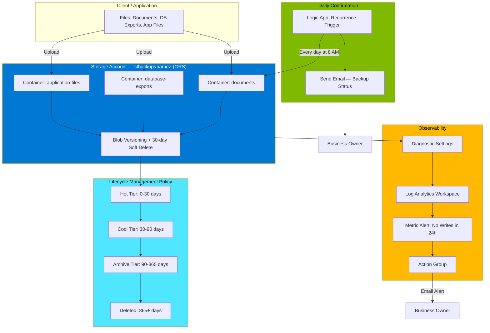
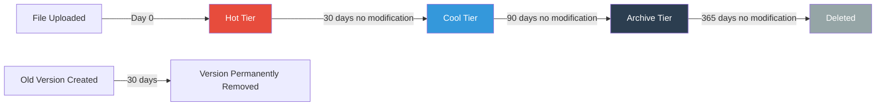

# Automated Backup System — Azure + Terraform

A fully automated, self-healing backup system built on Azure Blob Storage, with geo-redundant replication, blob versioning, automatic tiering for cost control, and a daily email confirmation workflow — all provisioned as code.

---

# Video of me doing the Project

[Automated-Backup-System-Azure video](https://www.youtube.com/watch?v=XDhg5Y53QVA)

## The Problem

Most small businesses back up data by having someone manually copy files to an external drive. When that person is out, busy, or simply forgets, nothing gets backed up — and when something eventually goes wrong, the data is gone.

This project replaces that manual process with infrastructure that:

- Automatically replicates every file across geographically separate Azure data centers the moment it's uploaded
- Keeps every previous version of every file, so accidental deletions or overwrites can be restored
- Automatically moves older files to cheaper storage tiers on a schedule, keeping costs under control with zero manual intervention
- Sends a daily confirmation email so the business owner knows, without checking, that the system is working
- Raises an alert automatically if backups silently stop happening

---

## Architecture



### Resource Map

```
rg-backup-<name>
├── Storage Account (stbackup<name>) — GRS, versioning enabled
│   ├── Container: documents
│   ├── Container: database-exports
│   ├── Container: application-files
│   └── Lifecycle Policy (30d → Cool, 90d → Archive, 365d → Delete)
├── Log Analytics Workspace (law-backup-<name>)
├── Storage Diagnostic Settings → routes logs to Log Analytics
├── Action Group (ag-backup-<name>)
├── Logic App Workflow (la-backup-confirm-<name>) → daily confirmation email
└── Monitor Metric Alert (alert-no-backup-writes) → fires on zero writes in 24h
```

---

## How It Works

### 1. Redundant, Versioned Storage

The storage account uses **GRS (Geo-Redundant Storage)**, meaning every file is asynchronously replicated from the primary region to a secondary region hundreds of miles away. If an entire Azure region goes down, the data still exists.

**Blob versioning** is what turns this from a plain file store into a true backup system. Every overwrite or delete preserves the prior version, and a 30-day soft-delete policy adds a second safety net on top of that.

### 2. Automatic Cost Control via Lifecycle Tiering



Without this policy, storage costs would grow indefinitely as backups accumulate. The lifecycle rule moves data to progressively cheaper tiers automatically, based purely on age — no manual cleanup required.

### 3. Daily Confirmation Workflow

A Logic App runs every morning on a recurrence trigger. It lists the contents of the `documents` container and emails a status summary, so the business owner has a passive daily signal that backups are healthy — without ever needing to log into the Azure Portal.

### 4. Failure Detection

A Monitor metric alert watches the `Transactions` metric on the storage account, filtered to write operations (`PutBlob`, `PutBlock`). If zero writes occur in a rolling 24-hour window, an alert fires through an Action Group — catching silent failures upstream (e.g., a broken backup script) before they become data-loss incidents.

---

## Tech Stack

| Layer | Tool |
|---|---|
| Infrastructure as Code | Terraform (`azurerm` provider ~> 3.0) |
| Cloud Platform | Microsoft Azure |
| Storage | Azure Blob Storage (GRS, versioning, lifecycle management) |
| Monitoring | Azure Monitor + Log Analytics Workspace |
| Automation / Notifications | Azure Logic Apps |
| CLI / Deployment | Azure CLI, PowerShell |

---

## Prerequisites

- [Terraform](https://developer.hashicorp.com/terraform/install)
- [Azure CLI](https://learn.microsoft.com/cli/azure/install-azure-cli)
- An active Azure subscription

```powershell
az login
az account set --subscription "Azure subscription 1"
```

---

## Deployment

1. Clone this repo and set your variables in `terraform.tfvars`:

    ```hcl
    yourname    = "yourname"
    location    = "East US"
    alert_email = "your.email@example.com"
    ```

2. Deploy the infrastructure:

    ```powershell
    terraform init
    terraform plan
    terraform apply
    ```

    This provisions 11 resources and takes 2–3 minutes.

3. Retrieve the storage connection string (needed for the Logic App connector):

    ```powershell
    terraform output -raw storage_account_connection_string
    ```

4. In the Azure Portal, open the Logic App and configure:
   - **Trigger:** Recurrence — daily at 8:00 AM
   - **Action 1:** Azure Blob Storage — *List blobs*, container `documents`
   - **Action 2:** *Send an email (V2)*, using the blob count in the message body

---

## Verifying the Backup System

Upload a test file, then overwrite it to confirm versioning is capturing history:

```powershell
az storage blob upload `
  --account-name stbackup<name> `
  --container-name documents `
  --name test/backup_test.txt `
  --file "$env:TEMP\backup_test.txt" `
  --auth-mode key --account-key "<key>" `
  --overwrite

az storage blob list `
  --account-name stbackup<name> `
  --container-name documents `
  --include v `
  --auth-mode key --account-key "<key>" `
  --output table
```

A successful run shows **two rows** for the same filename — the live version and the preserved prior version.

**Checklist:**
- [x] Storage account exists with GRS replication
- [x] Versioning enabled
- [x] Lifecycle rule `backup-lifecycle` active
- [x] Three containers present: `documents`, `database-exports`, `application-files`
- [x] Logic App running on daily recurrence
- [x] Metric alert `alert-no-backup-writes` configured
- [x] Test upload produced two blob versions

---

## Lessons Learned & Troubleshooting

A few real gotchas hit during deployment, worth documenting for future runs:

**`az storage blob` commands failing with "You do not have the required permissions"**
`--auth-mode login` relies on Azure AD RBAC data-plane roles (e.g., *Storage Blob Data Contributor*), which aren't granted automatically just because you created the account via Terraform. Fix: use `--auth-mode key --account-key "<key>"` instead, pulling the key from the Terraform connection string output.

**Logic App connector — "Create connection" defaults to Service Principal auth**
The Blob Storage connector's default authentication type requires a full Entra ID app registration. Switch **Authentication Type** to **Access Key**, and split the Terraform connection string into its two components:
- *Storage Account Name*: `stbackup<name>`
- *Access Key*: only the value between `AccountKey=` and `;EndpointSuffix` — not the full connection string.

**"Workflow validation failed... action 'List_blobs' not defined"**
This happens when a dynamic content token (like `length(body('List_blobs')?['value'])`) references an action that was renamed, removed, or never actually returned data. Delete the broken token and re-insert it via the dynamic content picker, or via **Code view**, to confirm the exact internal action name.

**Office 365 Outlook connector fails to authenticate**
Personal Microsoft accounts (e.g., `@outlook.com`, `@msn.com`, `@hotmail.com`) aren't supported by the *Office 365 Outlook* connector, which expects a work/school account. Use the **Outlook.com** connector instead for the *Send an email (V2)* step.

---

## Teardown

```powershell
terraform destroy
```

---

## Security Note

The storage account access key grants full read/write/delete access. Treat it like a password — never commit it to source control, and rotate it via **Storage Account → Access keys → Rotate key** if it's ever shared or exposed.# Automated-Backup-System-Azure
